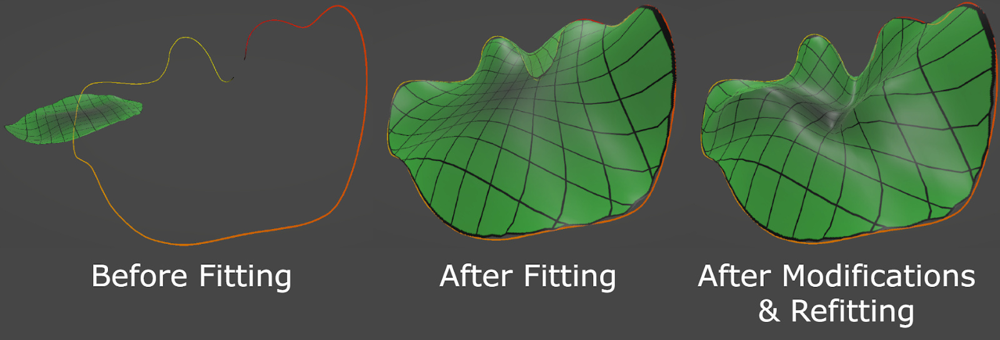

<!-- markdownlint-disable MD033 -->

## Intro

In-situ bioprinting is a form of automated robotic surgery that allows for minimally-invasive organ repair. Usually, the organ or organelle is instead printed in-vitro and transplanted; however, there are many drawbacks with in-vitro bioprinting, one being that certain tissues are difficult to transplant into the body. Similarly, there also exist alternatives to automated surgery—such as use of the Da Vinci Surgical System with its manual robotic control. Unfortunately, surgical procedures like bioprinting require many precise, repetitive movements, something difficult for a surgeon to perform manually. Additionally, automation would allow a surgeon to focus on the procedure as a whole, instead of focusing on each individual task, decreasing the risk of surgery.

Automated robotic surgeries require operators to send movement commands (toolpaths) to the robot. There is a need for intuitive, real-time development of complex toolpathing for the surgical field, as surgery is unpredictable and time-sensitive. Current solutions involve generating toolpaths in existing computer-aided manufacturing (CAM) software. This process is slow, and generated toolpaths are unalterable.

A computer application is proposed which will save valuable time in the operating room, making automated robotic surgery safer. To achieve this safety, the program must be intuitive, and it must run quickly. Additionally, a requirement specific to bioprinting must be met. The toolpaths output by the application must maintain a constant separation; if toolpaths are too far apart, they will not adhere to each other, and if they are too close together, they will overlap and create areas of unwanted material.

## Methods

Before generating toolpaths, geometry needs to be created to contain those paths. Basis-surfaces (b-surfaces) were used because of their smoothness and interactive simplicity. B-surfaces are mathematically defined surfaces that maintain continuous curvature at every point. Any toolpath generated across a b-surface will, in turn, be smooth, reducing future algorithmic complexity. Moreover, a b-surface is defined by only a small grid of control points. This allows manipulation of the surface to be clutter-free and intuitive (Fig. 1). Manipulation of the surface was implemented through a virtual reality (VR) user interface (UI) because it is an intuitive way to visualize and modify 3D geometry.

To maintain workflow simplicity, automatic surface generation is implemented. If a surgeon needs to cover an organic defect, it is desirable to only have to trace a loop around the defect and run an algorithm. Using least-squares optimization, paired with the mathematical nature of b-surfaces, we can instantaneously fit a surface to any closed loop. Additionally, surfaces can be changed and then refit to the loop while retaining their alterations (Fig. 2).

To achieve constant toolpath separation, path generation will be done procedurally, point-by-point, rather than purely mathematically. This achieves our required constant separation, but sacrifices computational speed. To account for this, algorithmic optimizations such as caching and input filtering are used to reduce generation time.

## Results, Conclusion, and Discussion

The created software demonstrates effortless workflow. Given a virtual tissue defect, a surgeon will only perform a few simple tasks in order to design a toolpath (Fig. 3). This is in contrast to most CAM software, where complex functionality is required to maximize precision, at the cost of simplicity and speed. Moreover, every algorithm except toolpath generation is executed in real-time. A benefit of this is that in the event of a design alteration, a task can be redone without additional delay.

For toolpath generation, runtimes were recorded for two toolpath modes as well as two surface sizes. Four tests were conducted: the generation time for small concentric paths, small rectilinear paths, large concentric paths, and large rectilinear paths. Respective times were 18.5s, 13.5s, 151s, & 106s (Fig. 4). These results show that toolpath generation is not only the slowest part of design, but that computation times grow rapidly as the surface size increases. This is not ideal, but some optimizations can be made. The algorithms currently iterate over all vertices of the toolpath, but the surface could instead be split into chunks so that only a fraction of the toolpath is run. Additionally, compute shaders, programs executed on the GPU instead of the CPU, could run multiple algorithms at the same time.

Separation measurements were sampled for concentric and rectilinear toolpaths. Two types of rectilinear toolpaths were sampled: “self-straightening” and “non-straightening”. The target separation was 0.004 units of length. Measurements were plotted on a binned histogram and a kernel density estimation plot (Fig. 5). Although concentric toolpaths outperform the others in stepover precision, they do not provide as much structural integrity compared to rectilinear toolpaths, with their much stronger, straight lines. This is in contrast to self-straightened toolpaths, which instead sacrifice precision for maximum structural integrity. Finally, non-straightened toolpaths demonstrate a compromise between concentric and straightened rectilinear toolpaths, boasting acceptable stepover precision, as well as suitably robust structure. All three toolpath modes can be used in combination to facilitate design and maximize safety.

## Figures

### *figure 1*

### *figure 2*

### *figure 3*

### *figure 4*

### *figure 5*

### Cat With Wings

